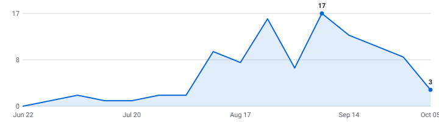

# Indian Fresher & New-Grad Jobs

   

A self-updating engine that tracks **full-time fresher & new-grad tech jobs** for the **2026 & 2027 batch** across India — so you don't have to. Instead of refreshing Naukri, LinkedIn, and a dozen career pages by hand, it reads company hiring feeds directly and keeps one live list, newest roles on top, refreshed automatically throughout the day.

**22 open roles · 23 new this week · 5,397 companies tracked · updated Oct 08, 2026 at 06:59 UTC**

**⭐ Star this repo ⭐** to save it and get notified when new roles land.

**Live:** [dashboard](https://rohan-droid7341.github.io/job-for-freshers/) · [RSS feed](https://rohan-droid7341.github.io/job-for-freshers/feed.xml) (instant alerts in any RSS app) · [JSON API](https://rohan-droid7341.github.io/job-for-freshers/api/jobs.json)

**🔔 New roles in your inbox:** [subscribe by email](https://rohan-droid7341.github.io/job-for-freshers/#subscribe) - one email a day, only when new jobs actually appeared, one-click unsubscribe. (Prefer RSS-to-email? [Feedrabbit works too](https://feedrabbit.com/subscriptions/new?url=https%3A%2F%2Fraw.githubusercontent.com%2FRohan-droid7341%2Fjob-for-freshers%2Fmain%2Fdocs%2Ffeed.xml).)
---

## New Grad — Entry Level (All Batches)  (22 open)

| Company | Role | Category | Pay & Specs | Location | Posted | Apply |
|---|---|---|---|---|---|---|
| T.D. Williamson | Quality Assurance Engineer I 🆕 | Software | — | India, Gujarat, Vadodara | Oct 07, 2026 | [Apply](https://tdwilliamson.wd1.myworkdayjobs.com/TDWCareers/job/India-Gujarat-Vadodara/Quality-Assurance-Engineer-I_REQ-03883) |
| GE Healthcare | Graduate Engineer Trainee | Software | B.Tech/BS | Bengaluru | Oct 05, 2026 | [Apply](https://gehc.wd5.myworkdayjobs.com/GEHC_ExternalSite/job/Bengaluru/Graduate-Engineer-Trainee_R4044861-1) |
| ISS / Institutional Shareholder Services | Junior Data Analyst | Data & ML/AI | B.Tech/BS | Mumbai, India | Oct 05, 2026 | [Apply](https://issgovernance.wd1.myworkdayjobs.com/isscareers/job/Mumbai-India/Junior-Data-Analyst_JR_10252) |
| Cigna Group | Automation Engineer Associate Analyst | Software | B.Tech/BS | Bengaluru, India | Oct 01, 2026 | [Apply](https://cigna.wd5.myworkdayjobs.com/cignacareers/job/Bengaluru-India/Automation-Engineer-Associate-Analyst_26012027) |
| Amazon | Software Development Engineer, Prime Video Live Events - Sports Data Platform | Data & ML/AI | 2+ Yrs B.Tech/BS | Bengaluru, Karnataka, India | Sep 30, 2026 | [Apply](https://www.amazon.jobs/en/jobs/10565511/software-development-engineer-prime-video-live-events-sports-data-platform) |
| Amazon | SDE I FTC | Other | B.Tech/BS | Hyderabad, Telangana, India | Sep 29, 2026 | [Apply](https://www.amazon.jobs/en/jobs/10563602/sde-i-ftc) |
| PTC | Associate Software Analyst | Software | B.Tech/BS | Pune, India | Sep 29, 2026 | [Apply](https://ptc.wd1.myworkdayjobs.com/ptc/job/Pune-India/Associate-Software-Analyst_JR112163) |
| Cohere Health | Associate Software Engineer | Software | B.Tech/BS | Hyderabad, Telangana, India | Sep 28, 2026 | [Apply](https://job-boards.greenhouse.io/coherehealth/jobs/7728230003) |
| Amazon | SDE-I, Rewards | Other | B.Tech/BS | Gurugram, Haryana, India | Sep 22, 2026 | [Apply](https://www.amazon.jobs/en/jobs/10555910/sde-i-rewards) |
| Netomi | Data Engineer I | Data & ML/AI | 2+ Yrs B.Tech/BS | Remote - India | Sep 21, 2026 | [Apply](https://jobs.lever.co/netomi/02b45afd-5a49-41b2-a244-b0ca76306692) |
| Amazon | Software Dev Engineer I FTC | Software | B.Tech/BS | Bengaluru, Karnataka, India | Sep 17, 2026 | [Apply](https://www.amazon.jobs/en/jobs/10551515/software-dev-engineer-i-ftc) |
| Cohere Health | Associate SDET Engineer | Software | — | Hyderabad, Telangana, India | Sep 16, 2026 | [Apply](https://job-boards.greenhouse.io/coherehealth/jobs/7693298003) |
| Amazon | SDE-1 (FTC) | Other | B.Tech/BS | Bengaluru, Karnataka, India | Sep 02, 2026 | [Apply](https://www.amazon.jobs/en/jobs/10525643/sde-1-ftc) |
| R1 RCM | Software Engineer I | Software | B.Tech/BS | Noida, India | Aug 28, 2026 | [Apply](https://r1rcm.wd1.myworkdayjobs.com/R1RCM/job/Noida-India/Software-Engineer-I_R260000005491) |
| AiPrise | Software Engineer I (Bangalore, India) | Software | ₹15L – ₹30L • Offers Bonus 2+ Yrs B.Tech/BS | Bengaluru | Aug 24, 2026 | [Apply](https://jobs.ashbyhq.com/aiprise/3763c791-a387-4078-9ca4-00cbfbf9b1a6) |
| Ema | AI/Data Resident | Data & ML/AI | B.Tech/BS | India - remote | Aug 24, 2026 | [Apply](https://jobs.ashbyhq.com/ema/e0511c0c-998f-4079-b62c-d2f164bf2c86) |
| ReliaQuest | Associate Software Engineer | Software | 0-1 Yr | Pune India Office | Aug 19, 2026 | [Apply](https://reliaquest.wd5.myworkdayjobs.com/ReliaQuest_Careers/job/Pune-India-Office/Associate-Software-Engineer_R15032) |
| AspenTech | Software Quality Engineer I | Software | B.Tech/BS | Noida | Jul 07, 2026 | [Apply](https://aspentech.wd5.myworkdayjobs.com/aspentech/job/Noida/Software-Quality-Engineer-I_R9206) |
| Silicon Laboratories | Engineer I - Software QA | Software | B.Tech/BS | Hyderabad | Feb 17, 2026 | [Apply](https://silabs.wd1.myworkdayjobs.com/SiliconlabsCareers/job/Hyderabad/Engineer-I---Software-QA_20641-1) |
| Rippling | Software Engineer I -Data Infrastructure | Data & ML/AI | — | Bangalore, India | — | [Apply](https://ats.rippling.com/rippling/jobs/28e76743-13cf-4e30-94f2-bbaa021a2d9b) |
| Perle | Elite Research Scientist - Frontier AI Evaluation | Data & ML/AI | — | India (Remote) | — | [Apply](https://ats.rippling.com/perle/jobs/f14c681e-5431-4677-8faa-a7ab38464863) |
| Mykaarma | Software Developer I | Software | — | NOIDA, India | — | [Apply](https://ats.rippling.com/mykaarma/jobs/854ee9f5-885b-4c76-8e6f-0330a11cdc54) |

## What this is

This is an engine, not a hand-kept list. It polls company career feeds several times a day, detects fresher / new-grad openings using a 4-tier signal detector (batch year → title band → experience range → eligibility signals), removes duplicates, and rebuilds this page automatically. Every link comes straight from the source — no stale copy-paste lists.

## What makes this different

- **🎓 Fresher-specific detection** — finds roles by what companies actually write: `2026 batch`, `Graduate Engineer Trainee`, `0-1 years`, `no active backlogs`, `CGPA ≥ 7.0`, `PPO`, `TCS NQT` — not just title keywords.
- **Real posted dates on every role** — pulled from each ATS directly, so newest-first actually means newest.
- **Skill tags + pay, extracted** — every posting's text is scanned for the stack it wants (Python, Java, C++, SQL, ...) and the CTC / stipend it states — searchable on the [dashboard](https://rohan-droid7341.github.io/job-for-freshers/), included in the CSV and API.
- **Alerts your way** — [email digests](https://rohan-droid7341.github.io/job-for-freshers/#subscribe), [RSS](https://rohan-droid7341.github.io/job-for-freshers/feed.xml), or Discord — plus a [live dashboard](https://rohan-droid7341.github.io/job-for-freshers/) with search and custom filters.
- **Covers the full India fresher ecosystem** — Naukri (fresher filter), Unstop (off-campus drives), Internshala, direct ATS (Greenhouse, Workday, Lever…), and custom scrapers for Flipkart, Swiggy, Razorpay, and more.
- **An engine, not a spreadsheet** — polled every 4 hours across all platforms with full source in this repo.

## Scope

- **Roles:** Full-time entry-level / fresher — Software Engineering, Data Science & ML, and closely related tech roles
- **Batch:** 2026 and 2027 passouts (freshers & final-year)
- **Region:** India & Verified Remote
- **What we detect:** Graduate Engineer Trainee, Associate SWE/SDE, Junior Developer, System Engineer (TCS/Infosys band), Programmer Analyst Trainee (Cognizant), off-campus drives, and any role stating `2026 batch` / `2027 passout` / `0-1 years` in the JD

## About

I built this engine because finding fresher jobs in India is painful — Naukri floods you with spam, LinkedIn shows you senior roles, and off-campus drives close before you even hear about them. This engine watches everything automatically and surfaces only what's relevant for the 2026/2027 batch. Apply early — freshers who apply in the first 48 hours have a significantly higher callback rate.

## How to use

- Roles are grouped by batch year — **newest posting on top, oldest at the bottom.**
- The **Posted** column is the date the company published the role.
- **Flags:** 🆕 = spotted in the last 48 hours — apply immediately.
- The **Pay & Specs** column shows CTC / stipend + experience range + degree.
- Track your applications with [`data/jobs.csv`](data/jobs.csv) (opens in Excel / Google Sheets).
- Missing a company? Adding one takes a single line — see [CONTRIBUTING.md](CONTRIBUTING.md).

---

## 📅 Drop Radar — when companies usually post for 2026 batch

Stop refreshing career pages. Every date here is **real or verified** — no third-party list. 🎯 = the engine **saw the drop itself** from the company's own careers API; the rest are hand-checked typical opening windows for marquee names. ✅ = already live in the list above.

> **Heads up:** companies trend *earlier* every cycle, and "~Aug" is a month, not a day. Treat "expected" as when to **start watching**, and "rolling" companies as worth checking year-round.

| Company | Typical opening | Expected this cycle | Status |
|---|---|---|---|
| Amazon | ~Jul | ~Jul · any day now | ⏳ waiting |
| Akuna Capital | ~Aug | ~Aug · any day now | ⏳ waiting |
| Citadel | ~Aug | ~Aug · any day now | ⏳ waiting |
| Citadel Securities | ~Aug | ~Aug · any day now | ⏳ waiting |
| Databricks | ~Aug | ~Aug · any day now | ⏳ waiting |
| DoorDash | ~Aug | ~Aug · any day now | ⏳ waiting |
| DRW | ~Aug | ~Aug · any day now | ⏳ waiting |
| Five Rings | ~Aug | ~Aug · any day now | ⏳ waiting |
| Google | ~Aug | ~Aug · any day now | ⏳ waiting |
| Jane Street | ~Aug | ~Aug · any day now | ⏳ waiting |
| Meta | ~Aug | ~Aug · any day now | ⏳ waiting |
| Optiver | ~Aug | ~Aug · any day now | ⏳ waiting |
| Pinterest | ~Aug | ~Aug · any day now | ⏳ waiting |
| Salesforce | ~Aug | ~Aug · any day now | ⏳ waiting |
| SIG | ~Aug | ~Aug · any day now | ⏳ waiting |
| Snowflake | ~Aug | ~Aug · any day now | ⏳ waiting |
| Tower Research Capital | ~Aug | ~Aug · any day now | ⏳ waiting |
| Uber | ~Aug | ~Aug · any day now | ⏳ waiting |
| Adobe | ~Sep | ~Sep · any day now | ⏳ waiting |
| Airbnb | ~Sep | ~Sep · any day now | ⏳ waiting |
| Bloomberg | ~Sep | ~Sep · any day now | ⏳ waiting |
| Dropbox | ~Sep | ~Sep · any day now | ⏳ waiting |
| Hudson River Trading | ~Sep | ~Sep · any day now | ⏳ waiting |
| Plaid | ~Sep | ~Sep · any day now | ⏳ waiting |
| Point72 | ~Sep | ~Sep · any day now | ⏳ waiting |
| Robinhood | ~Sep | ~Sep · any day now | ⏳ waiting |
| Roblox | ~Sep | ~Sep · any day now | ⏳ waiting |
| Stripe | ~Sep | ~Sep · any day now | ⏳ waiting |
| D.E. Shaw | ~Oct | ~Oct · any day now | ⏳ waiting |
| Coinbase | ~Dec | ~Dec | ⏳ waiting |

_42 companies on the [full radar](https://rohan-droid7341.github.io/job-for-freshers/#radar). "~Aug" = hand-verified typical month, not a promise of the day; "rolling" = posts year-round; "waiting" = not seen in our tracked feeds yet, not a guarantee it isn't out somewhere else._

<strong>Recently closed</strong> — 10 roles taken down in the last 14 days

| Company | Role | Cycle | Closed |
|---|---|---|---|
| MiQ | Software Engineer I | new_grad | 2026-10-07 |
| Priceline | Associate Software Engineer | new_grad | 2026-10-07 |
| Amazon | SDE-1, Expansions Tech and Product | new_grad | 2026-10-07 |
| Dun & Bradstreet | Software Engineer I (R-20039) | new_grad | 2026-10-07 |
| TriNet | Associate Data Scientist | new_grad | 2026-10-07 |
| Alegeus | Associate Engineer - QA | new_grad | 2026-10-06 |
| Global Payments | Associate SDET Specialist | new_grad | 2026-10-06 |
| Aera Technology | Associate Data Scientist – Modeling, Analytics & Pipelines | new_grad | 2026-10-06 |
| Shell | Associate QA Analyst - Endur | new_grad | 2026-10-06 |
| Varex Imaging Corporation | Applications System Engineer | new_grad | 2026-10-06 |

---

## Hiring timeline

Fresher job postings per week, from each role's real published date — redrawn automatically on every run. When this line takes off, campus season and off-campus drives are in full swing:

<picture>
  <source media="(prefers-color-scheme: dark)" srcset="docs/trends-dark.svg">
  
</picture>

## How it stays current

A Python engine reads public company hiring feeds directly, keeps the roles that match the fresher/new-grad scope above, de-duplicates across sources, records each role's published date once (so it never shifts), and regenerates this page through GitHub Actions every 4 hours. It polls every company concurrently (async) with retry/backoff and per-host rate limits. The full source is in this repo.

_Engine (last run): 5,397 companies across 18 ATS platforms · 99% fetch success · completed in 320.2s · median detection latency 668 min · real posted dates on 87% of open roles._

## Platforms Scraped

The engine currently extracts live data from the following platforms:
- **Indian Job Portals:** Naukri (experience=0 / fresher filter), Internshala, Wellfound
- **Direct ATS (Applicant Tracking Systems):** Greenhouse, Lever, Ashby, SmartRecruiters, Workable, Workday, Breezy, Recruitee, Rippling, Eightfold, Oracle
- **Direct Enterprise & Custom Scrapers:** Amazon (India Jobs), Custom Playwright Scrapers (Flipkart, Swiggy, Razorpay, CRED, InMobi, Rapido, Blinkit, Groww, CARS24, Urban Company, Delhivery)

## Contributing

Adding a company takes one line, see [CONTRIBUTING.md](CONTRIBUTING.md). Suggestions and pull requests are welcome.

## Note on dates

The **Posted** column shows when a role was published, newest at the top. Dates are pulled straight from each job portal. Portals that don't expose a date show a dash (—). Know the real date for a dashed role? Open a PR.

Roles can close at any time — always confirm on the company's own site before applying.
